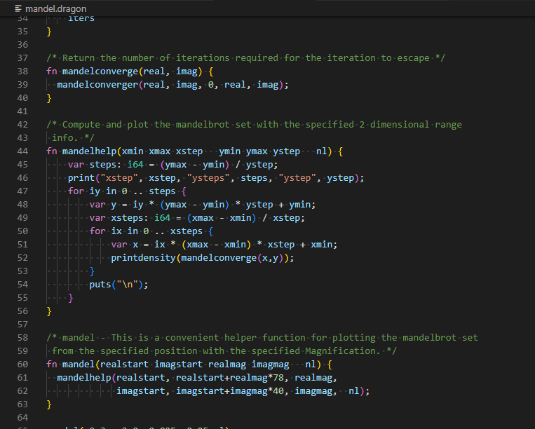

# mascal README

A Visual Studio code extension for mascal language syntax highlighting.

## Features

A simple extension to highlight syntax of mascal language.

It is not published to the marketplace, because the language syntax is not finished yet.

## Build and Install

First, install vsce, the VSCode extension manager.

    npm install -g @vscode/vsce

Use it to create a package. A file named `mascal-0.0.1.vsix` should appear.

    vsce package

Install to your local environment with

    code --install-extension mascal-0.0.1.vsix

See [the official guide](https://code.visualstudio.com/api/working-with-extensions/publishing-extension) for more information.

## Language server

The language server can provide the editor with syntax errors, type hints and annotations on VSCode.
It requires the server to be built written in Rust.
Since it is pre-alpha stage, we do not have a mechanism to bundle the built binaries with the extension.
You will need to build and locally debug the extension to see the effect by following the steps below.

* `cd vscode-ext/mascal-lsp-server`
* `cargo b`
* `cd vscode-ext`
* `npm run compile`
* Press F5 to start debugging
